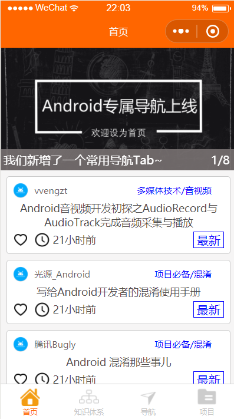
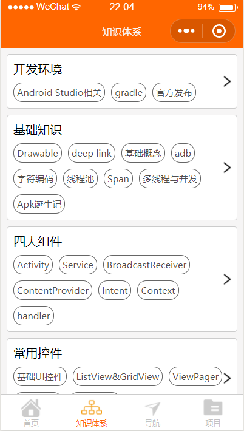
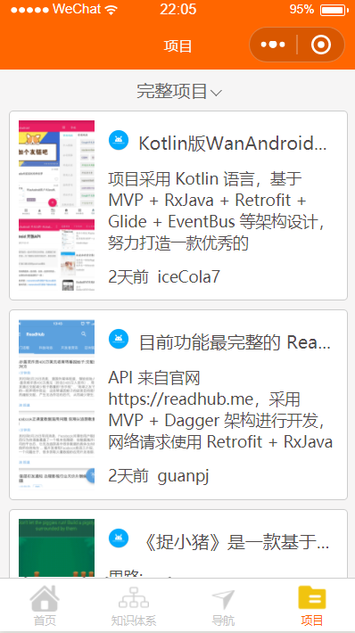
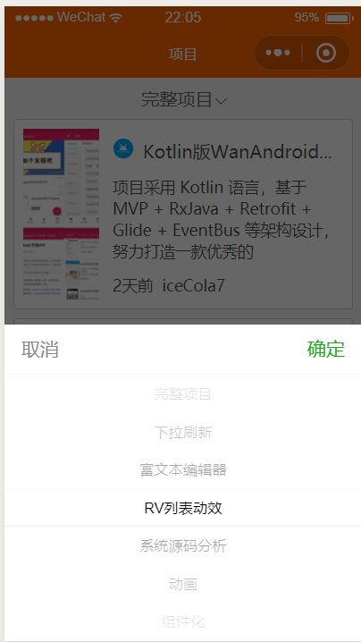

## 前言
  &nbsp;&nbsp;&nbsp;&nbsp;最近换了新工作，隔壁项目组的要用小程序写项目，所以我也自学了一下小程序，并根据鸿洋的wanandroid提供的api以及网上一些开源的wanandroid的android版本写了一个小程序版的wanandroid.

## API
https://github.com/hongyangAndroid/wanandroid
## 主要功能
- ### 首页 
&nbsp;&nbsp;&nbsp;&nbsp;&nbsp;&nbsp;&nbsp;&nbsp;包含轮播图以及最新的文章列表
- ### 知识体系
&nbsp;&nbsp;&nbsp;&nbsp;&nbsp;&nbsp;&nbsp;&nbsp;知识体系页面列出了开发环境，基础知识等三十个多个模块，每个模块又包含了很多小模块，比如开发环境下面就有Android studio相关，gradle,官方发布这三个小模块，当点击这些小模块的时候能进入这个小模块分类的详细文章列表。

- ### 导航
&nbsp;&nbsp;&nbsp;&nbsp;&nbsp;&nbsp;&nbsp;&nbsp;导航这个模块列出了常用网站，个人博客以及一些常用工具等。当点击一个模块的小模块时可以进入相应的专题，比如点击常用网站的简书就能链接到简书等。

- ### 项目
 &nbsp;&nbsp;&nbsp;&nbsp;&nbsp;&nbsp;&nbsp;&nbsp;项目这个模块则是收录了一些网上开源的学习项目，种类很多，通过点击列表页面上方的title可以弹出一个picker选择框来选择你要查看的项目分类。

## 项目截图

## 总结
&nbsp;&nbsp;&nbsp;&nbsp;&nbsp;&nbsp;&nbsp;&nbsp;整个项目是我学习小程序的练手作品，主要包括小程序的一些组件的使用比如swiper，picker等组件的用法，以及小程序中事件的学习和分包策越的使用。总的来说小程序使用了前端技术栈js/wxml/wxss 运行在微信app自己的上下文中，最终会把界面翻译成原生的控件显示出来，来达到和原生APP性能相当的体验。

## 吐槽
小程序的每个页面都有自己的wxml和wxss来展示，每个页面除了能使用全局的wxss的样式外并不能使用一些公共的页面，导致如果两个页面长的差不多的时候就必须得写两份差不多的wxml了，复用性差。

## Thanks

感谢所有优秀的开源项目
